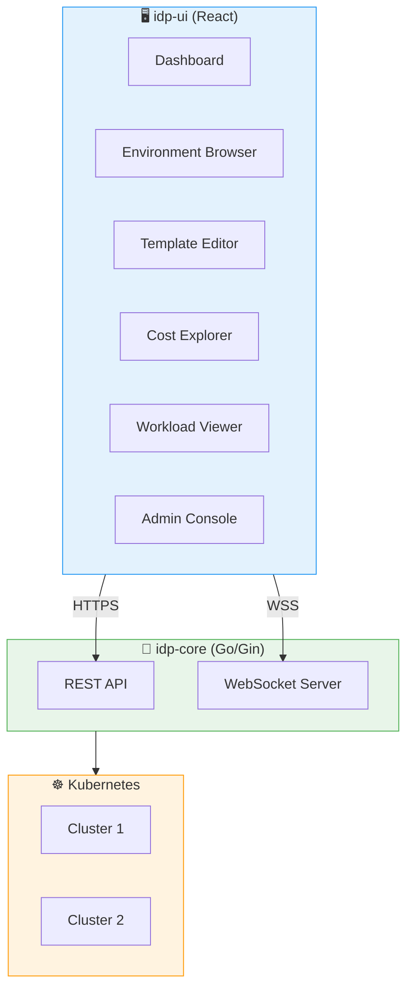
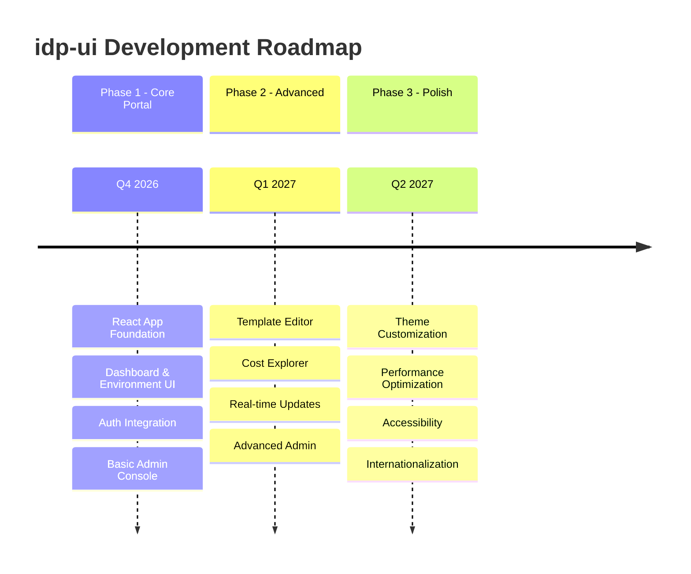

# 📋 idp-ui — Product Requirements Document (PRD) Overview

> **Project**: `idp-ui`
> **Owner**: Platform Engineering Team
> **Last Updated**: May 21, 2026
> **Status**: 📋 Planning
> **Backend**: [idp-core](https://github.com/davidsugianto/idp-core)

---

## 🎯 Executive Summary

`idp-ui` is the web-based Developer Portal for the Internal Developer Platform (IDP). It provides developers with a self-service interface for environment management, deployment, monitoring, and cost analysis — all powered by the [idp-core](https://github.com/davidsugianto/idp-core) API.

### Project Vision

Transform the idp-core API platform into a full IDP with an intuitive, modern web interface that enables developers to self-serve without learning the underlying API.

---

## 🏗️ Architecture Overview

---

## 📅 Phase Roadmap

---

## 🚀 Phase 1: Core Portal

**Status**: 📋 Planning
**Timeline**: Q4 2026
**Document**: [PRD_PHASE_1.md](./PRD_PHASE_1.md)

### Goals

| Goal | Metric | Target |
|------|--------|--------|
| Developer self-service | UI adoption rate | > 80% |
| Environment management | Environments created via UI | > 50% |
| Admin operations | Admin tasks via UI | > 60% |

### Key Features

- 🖥️ **Dashboard** - Overview with metrics and quick actions
- 📦 **Environment Browser** - Create, manage, and monitor environments
- 👤 **Auth Integration** - OIDC login, session management
- ⚙️ **Admin Console** - User, team, and role management
- 🔑 **API Key Management** - Create and manage API keys

---

## 📋 Phase 2: Advanced (Planned)

**Status**: 📋 Planning
**Timeline**: Q1 2027
**Document**: `PRD_PHASE_2.md` (To be created)

### Key Features

- 📝 **Template Editor** - Create and edit environment templates
- 📊 **Cost Explorer** - Visual charts and spend analysis
- 🔌 **Real-time Updates** - WebSocket integration for live status
- 📚 **Service Catalog** - Browse and discover services

---

## 🔮 Phase 3: Polish (Future)

**Status**: 🔮 Roadmap
**Timeline**: Q2 2027
**Document**: `PRD_PHASE_3.md` (To be created)

### Key Features

- 🎨 **Theme Customization** - Light/dark mode, branding
- ⚡ **Performance Optimization** - Bundle size, caching
- ♿ **Accessibility** - WCAG 2.1 AA compliance
- 🌐 **Internationalization** - Multi-language support

---

## 📊 Success Metrics

| KPI | Target | Measurement |
|-----|--------|-------------|
| UI Adoption | > 80% developers | Unique users vs API-only |
| Page Load Time | < 2s | Lighthouse performance |
| First Contentful Paint | < 1.5s | Lighthouse |
| User Satisfaction | > 4.5/5 | User surveys |
| Accessibility Score | > 90 | Lighthouse a11y |

---

## 🛠️ Technology Stack

| Component | Technology | Version |
|-----------|------------|---------|
| Framework | React | 18+ |
| Build Tool | Vite | 5+ |
| UI Library | Ant Design | 5+ |
| State Management | Zustand / React Query | Latest |
| API Client | Axios | Latest |
| Real-time | WebSocket | - |
| Charts | Recharts | Latest |
| Forms | React Hook Form + Zod | Latest |
| Router | React Router | 6+ |
| Testing | Vitest + React Testing Library | Latest |
| TypeScript | TypeScript | 5+ |

---

## 🗓️ Timeline Summary

| Phase | Timeline | Status | Key Deliverables |
|-------|----------|--------|------------------|
| Phase 1 - Core Portal | Q4 2026 | 📋 Planning | Dashboard, Environment UI, Auth, Admin |
| Phase 2 - Advanced | Q1 2027 | 📋 Planning | Templates, Costs, Real-time |
| Phase 3 - Polish | Q2 2027 | 🔮 Roadmap | Themes, Performance, Accessibility |

---

## ⚠️ Risks & Mitigations

| Risk | Impact | Mitigation |
|------|--------|------------|
| API changes in idp-core | High | Versioned API; contract tests; type generation |
| Frontend complexity | Medium | Component library; strict code conventions |
| WebSocket scalability | Medium | Redis pub/sub backend; reconnect logic |
| UI performance | Medium | Code splitting; lazy loading; caching |
| Browser compatibility | Low | Polyfills; browserlist config |

---

## 📎 References

- [PRD Phase 1](./PRD_PHASE_1.md)
- [idp-core](https://github.com/davidsugianto/idp-core)
- [idp-core Phase 3 PRD](https://github.com/davidsugianto/idp-core/blob/main/docs/prd/PRD_PHASE_3.md)
- [Ant Design](https://ant.design/)
- [React Documentation](https://react.dev/)

---

## 📝 Document History

| Version | Date | Author | Changes |
|---------|------|--------|---------|
| 0.1.0 | May 21, 2026 | Platform Engineering | Initial PRD overview |