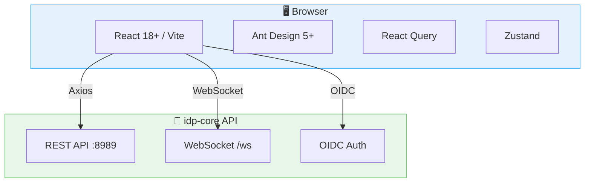

# 📋 idp-ui — Product Requirements Document (PRD) Phase 1

> **Project**: `idp-ui`
> **Phase**: 1 - Core Portal
> **Owner**: Platform Engineering Team
> **Last Updated**: May 21, 2026
> **Status**: 📋 Planning
> **Timeline**: Q4 2026
> **Backend**: [idp-core](https://github.com/davidsugianto/idp-core)
> **Overview**: [PRD.md](./PRD.md)

---

## 🎯 Executive Summary

Phase 1 delivers the core Developer Portal — a React-based web application that provides developers with a self-service interface for managing environments, viewing workloads, and handling administrative tasks. This phase establishes the frontend foundation and integrates with the existing idp-core API.

This is the first of three planned phases for idp-ui. See the [PRD overview](./PRD.md) for the full roadmap.

### Phase 1 Goals

| Goal | Metric | Target |
|------|--------|--------|
| Developer self-service | UI adoption rate | > 80% |
| Environment management | Environments created via UI | > 50% |
| Admin operations | Admin tasks via UI | > 60% |
| Page load performance | Lighthouse score | > 90 |

---

## 🏗️ Architecture



### Project Structure

```
idp-ui/
├── public/                 # Static assets
├── src/
│   ├── components/         # Reusable components
│   │   ├── common/         # Button, Input, Modal, etc.
│   │   ├── layout/         # AppLayout, Header, Sidebar
│   │   └── forms/          # FormField, FormSection
│   ├── pages/              # Page components
│   │   ├── Dashboard/
│   │   ├── Environments/
│   │   ├── Settings/
│   │   └── Admin/
│   ├── hooks/              # Custom React hooks
│   │   ├── useAuth.ts
│   │   ├── useEnvironments.ts
│   │   └── useWebSocket.ts
│   ├── services/           # API service functions
│   │   ├── api.ts          # Axios instance
│   │   ├── auth.ts
│   │   ├── environments.ts
│   │   └── admin.ts
│   ├── stores/             # Zustand stores
│   │   ├── authStore.ts
│   │   └── uiStore.ts
│   ├── utils/              # Utility functions
│   ├── types/              # TypeScript types
│   ├── constants/          # Constants and config
│   ├── App.tsx             # Root component with router
│   └── main.tsx            # Entry point
├── package.json
├── vite.config.ts
├── tsconfig.json
└── .gitignore
```

---

## 🖥️ Feature 1: Dashboard

### Overview

A landing page that provides developers with an at-a-glance view of their environments, costs, and platform recommendations.

### User Stories

| ID | User Story | Priority |
|----|------------|----------|
| DASH-001 | As a developer, I want to see my environments count and status so I can quickly assess my projects | P0 |
| DASH-002 | As a developer, I want to see recent environments with status so I can navigate to them | P0 |
| DASH-003 | As a developer, I want to see cost summary cards so I understand spending at a glance | P1 |
| DASH-004 | As a developer, I want to see rightsizing recommendations so I can optimize resources | P1 |

### UI Mockup

```
┌─────────────────────────────────────────────────────────────┐
│  IDP Platform                                    [User ▼]   │
├─────────────────────────────────────────────────────────────┤
│  ┌──────────┐  ┌──────────┐  ┌──────────┐  ┌──────────┐     │
│  │ Envs: 12 │  │ Active: 8│  │ Cost:$2.4k│  │ Alerts: 2│     │
│  └──────────┘  └──────────┘  └──────────┘  └──────────┘     │
│                                                             │
│  Recent Environments                    [+ New Environment] │
│  ┌─────────────────────────────────────────────────────┐   │
│  │ Name          Team     Status    Cost    Updated    │   │
│  │ feature-auth  backend  ✅ Ready  $120    2h ago     │   │
│  │ staging-api   backend  ⚠ Syncing $340    5m ago     │   │
│  │ dev-frontend  frontend ✅ Ready  $89     1d ago     │   │
│  └─────────────────────────────────────────────────────┘   │
│                                                             │
│  Recommendations                        [View All →]        │
│  ┌─────────────────────────────────────────────────────┐   │
│  │ 💡 Scale down api-deployment (save ~$45/mo)          │   │
│  │ 💡 Increase memory for worker-pod (OOM risk)         │   │
│  └─────────────────────────────────────────────────────┘   │
└─────────────────────────────────────────────────────────────┘
```

### API Dependencies

| Endpoint | Method | Purpose |
|----------|--------|---------|
| `/v1/environments` | GET | List environments with status |
| `/v1/costs` | GET | Cost summary |
| `/v1/rightsizing/recommendations` | GET | Recommendations |

---

## 📦 Feature 2: Environment Browser

### Overview

A full-featured environment management interface that allows developers to create, view, and manage environments through an intuitive UI.

### User Stories

| ID | User Story | Priority |
|----|------------|----------|
| ENV-001 | As a developer, I want to browse all my environments so I can find specific ones | P0 |
| ENV-002 | As a developer, I want to create an environment through a wizard so I don't need the API | P0 |
| ENV-003 | As a developer, I want to view environment details including workloads so I can monitor status | P0 |
| ENV-004 | As a developer, I want to trigger GitOps sync so I can deploy updates | P0 |
| ENV-005 | As a developer, I want to filter by team, status, and cluster so I can find environments | P1 |
| ENV-006 | As a developer, I want to delete environments I no longer need | P1 |

### UI Mockup — Environment List

```
┌─────────────────────────────────────────────────────────────┐
│  Environments                                    [+ Create]  │
├─────────────────────────────────────────────────────────────┤
│  Filter: [All Teams ▼] [All Clusters ▼] [Status ▼]  [Search]│
│                                                             │
│  ┌─────────────────────────────────────────────────────────┐
│  │ 📦 feature-auth                                        │
│  │ Team: backend  |  Cluster: prod-us-east  |  ✅ Ready   │
│  │ ─────────────────────────────────────────────────────── │
│  │ Workloads: 4  |  Cost: $120/mo  |  Last sync: 2h ago   │
│  │                                                         │
│  │ [View Details] [Sync Now] [View Logs] [Delete]         │
│  └─────────────────────────────────────────────────────────┘
│                                                             │
│  ┌─────────────────────────────────────────────────────────┐
│  │ 📦 staging-api                                         │
│  │ Team: backend  |  Cluster: staging  |  ⚠ Syncing       │
│  │ ─────────────────────────────────────────────────────── │
│  │ Workloads: 6  |  Cost: $340/mo  |  Last sync: 5m ago   │
│  │                                                         │
│  │ [View Details] [Cancel Sync] [View Logs] [Delete]      │
│  └─────────────────────────────────────────────────────────┘
└─────────────────────────────────────────────────────────────┘
```

### UI Mockup — Environment Detail

```
┌─────────────────────────────────────────────────────────────┐
│  ← Back to Environments                                     │
│                                                             │
│  feature-auth                                     [Sync] [···]
│  Team: backend  |  Cluster: prod-us-east  |  Status: ✅ Ready│
│                                                             │
│  ── Tabs ────────────────────────────────────────────────── │
│  [Overview] [Workloads] [Logs] [Settings]                    │
│                                                             │
│  Environment Info                                           │
│  ┌─────────────────────────────────────────────────────┐   │
│  │ Namespace:    feature-auth                           │   │
│  │ Team:         backend                                │   │
│  │ Cluster:      prod-us-east                           │   │
│  │ Git Repo:     github.com/org/backend                  │   │
│  │ Git Branch:   feature/auth                           │   │
│  │ Last Sync:    2 hours ago                            │   │
│  │ Created:      3 days ago                             │   │
│  └─────────────────────────────────────────────────────┘   │
│                                                             │
│  Workloads                                                  │
│  ┌─────────────────────────────────────────────────────┐   │
│  │ Name           Type         Status    CPU    Memory  │   │
│  │ api-server     Deployment   ✅ Running 250m   512Mi  │   │
│  │ worker         Deployment   ✅ Running 100m   256Mi  │   │
│  │ redis          StatefulSet  ✅ Running 500m   1Gi    │   │
│  │ postgres       StatefulSet  ✅ Running 1      2Gi    │   │
│  └─────────────────────────────────────────────────────┘   │
└─────────────────────────────────────────────────────────────┘
```

### API Dependencies

| Endpoint | Method | Purpose |
|----------|--------|---------|
| `/v1/environments` | GET | List environments |
| `/v1/environments` | POST | Create environment |
| `/v1/environments/:id` | GET | Get environment details |
| `/v1/environments/:id` | DELETE | Delete environment |
| `/v1/environments/:id/sync` | POST | Trigger GitOps sync |
| `/v1/environments/:id/workloads` | GET | List workloads |

---

## 🔐 Feature 3: Authentication

### Overview

Integrate with idp-core OIDC authentication to provide login, session management, and token refresh.

### User Stories

| ID | User Story | Priority |
|----|------------|----------|
| AUTH-001 | As a user, I want to log in with my corporate credentials so I can access the platform | P0 |
| AUTH-002 | As a user, I want my session to persist across page refreshes so I don't keep logging in | P0 |
| AUTH-003 | As a user, I want to be redirected to login when my session expires | P0 |
| AUTH-004 | As a user, I want to log out securely | P1 |

### Auth Flow

```
┌──────┐     ┌──────────┐     ┌──────────┐     ┌──────────┐
│ User │     │  idp-ui  │     │ idp-core │     │ Keycloak │
└──┬───┘     └────┬─────┘     └────┬─────┘     └────┬─────┘
   │              │                │                │
   │  Visit /     │                │                │
   │─────────────>│                │                │
   │              │                │                │
   │              │ GET /auth/login│                │
   │              │───────────────>│                │
   │              │                │  Redirect to   │
   │              │                │  Keycloak      │
   │              │                │───────────────>│
   │              │                │                │
   │  Login Page  │                │                │
   │<───────────────────────────────────────────────│
   │              │                │                │
   │  Submit      │                │                │
   │───────────────────────────────────────────────>│
   │              │                │                │
   │              │                │<── Auth Code ──│
   │              │                │                │
   │              │    Token       │                │
   │              │<───────────────│                │
   │              │                │                │
   │  Dashboard   │                │                │
   │<─────────────│                │                │
```

### Implementation

```typescript
// services/auth.ts
interface AuthState {
  accessToken: string | null;
  refreshToken: string | null;
  user: User | null;
  isAuthenticated: boolean;
}

// stores/authStore.ts
const useAuthStore = create<AuthState>((set) => ({
  accessToken: null,
  refreshToken: null,
  user: null,
  isAuthenticated: false,
  login: async () => { /* OIDC redirect */ },
  logout: () => { /* clear tokens */ },
  refreshToken: async () => { /* refresh */ },
}));
```

### API Dependencies

| Endpoint | Method | Purpose |
|----------|--------|---------|
| `/auth/login` | GET | Initiate OIDC login |
| `/auth/callback` | POST | Handle OIDC callback |
| `/auth/refresh` | POST | Refresh access token |
| `/auth/logout` | POST | Logout |
| `/auth/me` | GET | Get current user |

---

## ⚙️ Feature 4: Admin Console

### Overview

An admin interface for managing users, teams, and roles within the platform.

### User Stories

| ID | User Story | Priority |
|----|------------|----------|
| ADM-001 | As a platform admin, I want to view and manage users so I can control access | P0 |
| ADM-002 | As a platform admin, I want to manage teams and members so I can organize users | P1 |
| ADM-003 | As a platform admin, I want to manage roles and permissions so I can enforce RBAC | P1 |
| ADM-004 | As a platform admin, I want to view audit logs so I can track actions | P1 |

### UI Mockup — User Management

```
┌─────────────────────────────────────────────────────────────┐
│  Admin / Users                                              │
├─────────────────────────────────────────────────────────────┤
│  [Users] [Teams] [Roles] [Audit Logs]                        │
│                                                             │
│  [+ Add User]                              [Search users...]│
│                                                             │
│  ┌─────────────────────────────────────────────────────┐   │
│  │ Name          Email              Status    Actions   │   │
│  │ Dev Eloper    developer@ex.com   ✅ Active [Edit]    │   │
│  │ Platform Admin admin@ex.com      ✅ Active [Edit]    │   │
│  │ Alice Wang    alice@ex.com       ✅ Active [Edit]    │   │
│  │ Bob Chen      bob@ex.com         ⚠ Pending [Edit]   │   │
│  └─────────────────────────────────────────────────────┘   │
│                                                             │
│  [← Previous]  Page 1 of 2  [Next →]                        │
└─────────────────────────────────────────────────────────────┘
```

### API Dependencies

| Endpoint | Method | Purpose |
|----------|--------|---------|
| `/v1/users` | GET | List users |
| `/v1/users` | POST | Create user |
| `/v1/users/:id` | GET | Get user details |
| `/v1/users/:id` | PATCH | Update user |
| `/v1/users/:id` | DELETE | Delete user |
| `/v1/teams` | GET/POST | List/Create teams |
| `/v1/teams/:id` | GET/PATCH/DELETE | Manage team |
| `/v1/teams/:id/members` | GET/POST | Manage members |
| `/v1/roles` | GET/POST | List/Create roles |
| `/v1/roles/:id` | GET/PATCH/DELETE | Manage role |
| `/v1/roles/assign` | POST | Assign role |
| `/v1/roles/revoke` | POST | Revoke role |
| `/v1/audit-logs` | GET | List audit logs |

---

## 🔑 Feature 5: API Key Management

### Overview

Allow users to create and manage API keys for automation and CI/CD integration.

### User Stories

| ID | User Story | Priority |
|----|------------|----------|
| KEY-001 | As a developer, I want to create API keys so I can automate deployments | P0 |
| KEY-002 | As a developer, I want to view my API keys so I can manage them | P1 |
| KEY-003 | As a developer, I want to revoke API keys I no longer need | P1 |

### API Dependencies

| Endpoint | Method | Purpose |
|----------|--------|---------|
| `/v1/api-keys` | GET | List API keys |
| `/v1/api-keys` | POST | Create API key |
| `/v1/api-keys/:id` | DELETE | Revoke API key |

---

## 🛠️ Technical Requirements

### Component Tree

```
App
├── AuthProvider
│   ├── LoginPage
│   └── CallbackPage
├── AppLayout
│   ├── Header
│   │   ├── Logo
│   │   ├── Navigation
│   │   └── UserMenu
│   ├── Sidebar
│   │   ├── NavItem (Dashboard)
│   │   ├── NavItem (Environments)
│   │   ├── NavItem (Settings)
│   │   └── NavItem (Admin)
│   └── Content
│       ├── DashboardPage
│       │   ├── StatCard
│       │   ├── EnvironmentTable
│       │   └── RecommendationList
│       ├── EnvironmentListPage
│       │   ├── FilterBar
│       │   └── EnvironmentCard
│       ├── EnvironmentDetailPage
│       │   ├── TabBar
│       │   ├── EnvironmentInfo
│       │   └── WorkloadTable
│       ├── EnvironmentCreatePage
│       │   └── CreateWizard
│       ├── SettingsPage
│       │   └── APIKeyList
│       └── AdminPage
│           ├── UserTable
│           ├── TeamTable
│           ├── RoleTable
│           └── AuditLogTable
```

### Pages & Routes

| Route | Page | Auth Required | Admin Only |
|-------|------|---------------|------------|
| `/login` | LoginPage | No | No |
| `/auth/callback` | CallbackPage | No | No |
| `/` | DashboardPage | Yes | No |
| `/environments` | EnvironmentListPage | Yes | No |
| `/environments/new` | EnvironmentCreatePage | Yes | No |
| `/environments/:id` | EnvironmentDetailPage | Yes | No |
| `/settings` | SettingsPage | Yes | No |
| `/settings/api-keys` | APIKeyPage | Yes | No |
| `/admin` | AdminDashboard | Yes | Yes |
| `/admin/users` | UserManagementPage | Yes | Yes |
| `/admin/teams` | TeamManagementPage | Yes | Yes |
| `/admin/roles` | RoleManagementPage | Yes | Yes |
| `/admin/audit-logs` | AuditLogPage | Yes | Yes |

### Environment Variables

```bash
# .env
VITE_API_BASE_URL=http://localhost:8989
VITE_OIDC_ISSUER=http://localhost:8081/realms/idp-core
VITE_OIDC_CLIENT_ID=idp-core
VITE_OIDC_REDIRECT_URI=http://localhost:5173/auth/callback
```

### Key Dependencies

```json
{
  "dependencies": {
    "react": "^18.3.0",
    "react-dom": "^18.3.0",
    "react-router-dom": "^6.23.0",
    "antd": "^5.20.0",
    "@ant-design/icons": "^5.4.0",
    "axios": "^1.7.0",
    "@tanstack/react-query": "^5.45.0",
    "zustand": "^4.5.0",
    "react-hook-form": "^7.51.0",
    "zod": "^3.23.0",
    "@hookform/resolvers": "^3.6.0",
    "dayjs": "^1.11.0"
  },
  "devDependencies": {
    "typescript": "^5.5.0",
    "vite": "^5.3.0",
    "@vitejs/plugin-react": "^4.3.0",
    "vitest": "^1.6.0",
    "@testing-library/react": "^16.0.0",
    "@testing-library/jest-dom": "^6.4.0",
    "eslint": "^8.57.0",
    "@typescript-eslint/parser": "^7.0.0"
  }
}
```

---

## 📊 Success Metrics

| KPI | Target | Measurement |
|-----|--------|-------------|
| UI Adoption | > 80% developers | Unique users vs API-only |
| Page Load Time | < 2s | Lighthouse performance |
| First Contentful Paint | < 1.5s | Lighthouse |
| Time to Interactive | < 3s | Lighthouse |
| Environment Creation | > 50% via UI | UI vs API creations |
| User Satisfaction | > 4.5/5 | User surveys |

---

## ⚠️ Risks & Mitigations

| Risk | Impact | Mitigation |
|------|--------|------------|
| idp-core API changes | High | Versioned API; type generation from OpenAPI |
| OIDC flow complexity | Medium | Use established OIDC client library |
| Large component tree | Medium | Code splitting; lazy loading routes |
| State management complexity | Low | Zustand for simple global state; React Query for server state |
| Browser compatibility | Low | Target modern browsers; polyfills for edge cases |

---

## 🗓️ Timeline

| Milestone | Duration | Deliverables |
|-----------|----------|--------------|
| M1: Project Setup | 1 week | Vite + React scaffold, routing, Ant Design theme, API client |
| M2: Auth & Layout | 1 week | OIDC login, AppLayout, Header, Sidebar, protected routes |
| M3: Dashboard & Environments | 2 weeks | Dashboard, Environment list, detail, create wizard |
| M4: Admin Console | 1 week | User management, teams, roles, audit logs |
| M5: Settings & Polish | 1 week | API keys, error handling, loading states, responsive |

**Total Duration**: ~6 weeks

---

## 📎 References

- [PRD Overview](./PRD.md)
- [idp-core](https://github.com/davidsugianto/idp-core)
- [Ant Design](https://ant.design/)
- [React Documentation](https://react.dev/)
- [Vite](https://vitejs.dev/)
- [React Router](https://reactrouter.com/)
- [React Query](https://tanstack.com/query)
- [Zustand](https://zustand-demo.pmnd.rs/)

---

## 🔮 Future Phases

The following features are planned for future phases of idp-ui and will be documented in separate PRDs.

### Phase 2: Advanced (Q1 2027)

Planned PRD: `PRD_PHASE_2.md`

| Feature | Description |
|---------|-------------|
| Template Editor | Create and edit environment templates with live preview |
| Cost Explorer | Visual charts and reports for cost analysis |
| Real-time Updates | WebSocket integration for live environment status and logs |
| Service Catalog | Browse, register, and discover services |

These features depend on [idp-core](https://github.com/davidsugianto/idp-core) API endpoints for templates, costs, services, and WebSocket support.

### Phase 3: Polish (Q2 2027)

Planned PRD: `PRD_PHASE_3.md`

| Feature | Description |
|---------|-------------|
| Theme Customization | Light/dark mode, custom branding |
| Performance Optimization | Bundle size, code splitting, caching |
| Accessibility (a11y) | WCAG 2.1 AA compliance |
| Internationalization (i18n) | Multi-language support |

---

## 📝 Document History

| Version | Date | Author | Changes |
|---------|------|--------|---------|
| 0.1.0 | May 21, 2026 | Platform Engineering | Initial Phase 1 PRD |